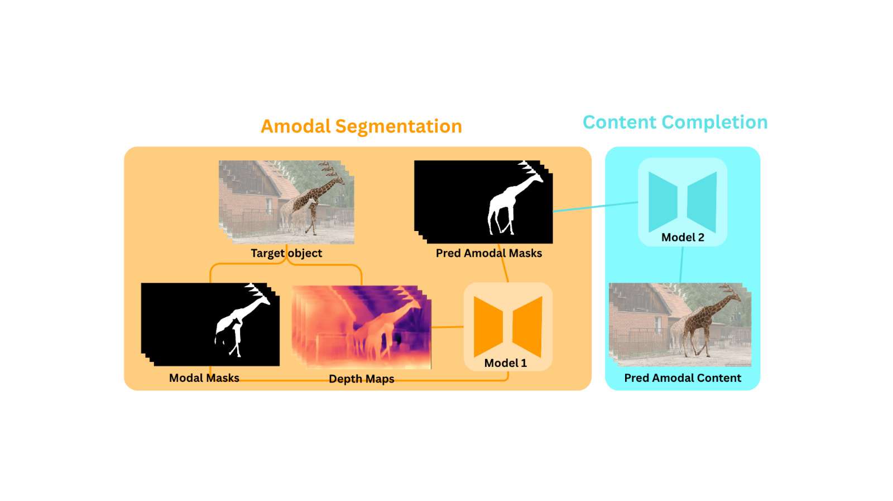
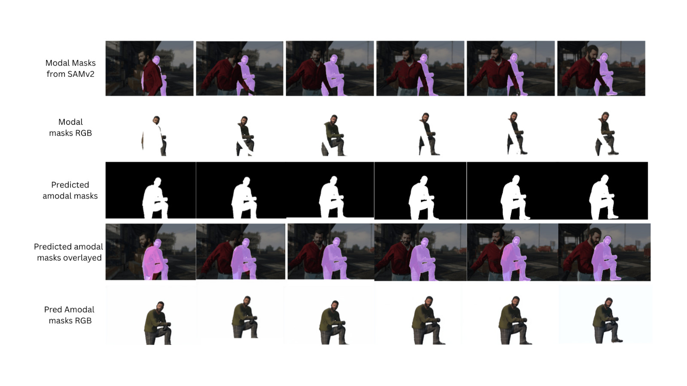
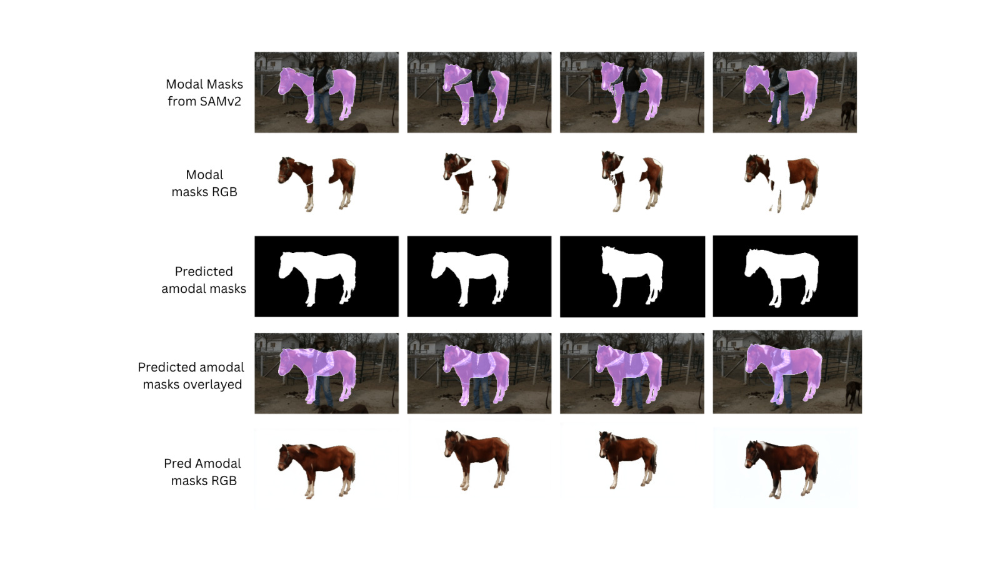
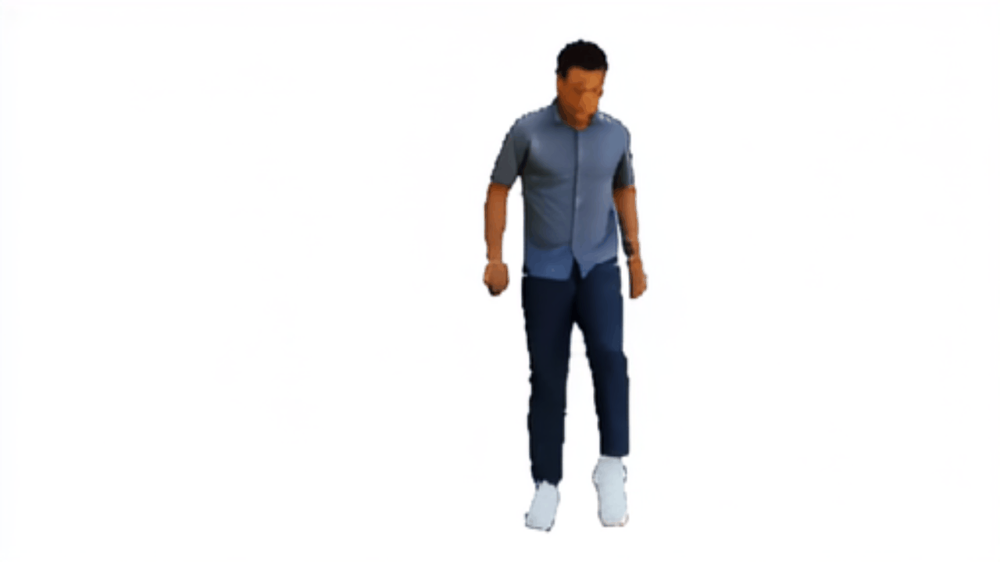

# Amodal Segmentation using difffusion models


## Getting Started

### Installation

#### 1. Clone the repository

```bash
git clone https://github.com/eash123-glitch/Amodal-segmentation-using-diffuion-models
cd Amodal-segmentation-using-diffuion-models
```

#### 2. Create and activate a virtual environment

```bash
conda create --name Amodal-segmentation-using-diffuion-models python=3.10
conda activate Amodal-segmentation-using-diffuion-models
pip install -r requirements.txt
```


For **Depth Anything V2**'s checkpoints, download the Pre-trained Models (e.g., Depth-Anything-V2-Large) from [this link](https://github.com/DepthAnything/Depth-Anything-V2) and place them inside the `checkpoints/` folder.



## Evaluation

We currently support evaluation on **SAIL-VOS-2D** and **TAO-Amodal**.

### 1. Download Datasets

Download [SAIL-VOS-2D](https://sailvos.web.illinois.edu/_site/index.html) and [TAO-Amodal](https://huggingface.co/datasets/chengyenhsieh/TAO-Amodal) by following their official instructions.


## Finetuning on SAIL-VOS
We currently support fine-tuning for both the amodal segmentation and content completion stages on SAIL-VOS, based on [Stable Video Diffusion](https://huggingface.co/stabilityai/stable-video-diffusion-img2vid-xt) and adapted from [SVD Xtend](https://github.com/pixeli99/SVD_Xtend).

*Note: Please replace the paths in the commands with your own dataset and annotation paths. The json annotations can be downloaded as shown in the Evaluation section.*

**Amodal segmentation fine-tuning**

For end-to-end fine-tuning conditioned on modal masks and depth maps. The training script is:
```bash
CUDA_VISIBLE_DEVICES=0,1,2,3,4,5,6,7 accelerate launch train/train_diffusion_vas_amodal_segm.py \
    --data_path /path/to/SAILVOS_2D/ \
    --train_annot_path /path/to/diffusion_vas_sailvos_train.json \
    --eval_annot_path /path/to/diffusion_vas_sailvos_val.json \
    --output_dir /path/to/train_diffusion_vas_amodal_seg_outputs
```


**Content completion fine-tuning**

For end-to-end fine-tuning conditioned on modal RGB images and predicted amodal masks:
```bash
CUDA_VISIBLE_DEVICES=0,1,2,3,4,5,6,7 accelerate launch train/train_diffusion_vas_content_comp.py \
    --data_path /path/to/SAILVOS_2D/ \
    --train_annot_path /path/to/sailvos_complete_objs_as_occluders.json \
    --eval_annot_path /path/to/sailvos_complete_objs_as_occluders.json \
    --occluder_data_path /path/to/sailvos_complete_objs_as_occluders.json \
    --output_dir /path/to/train_diffusion_vas_content_comp_outputs
```



